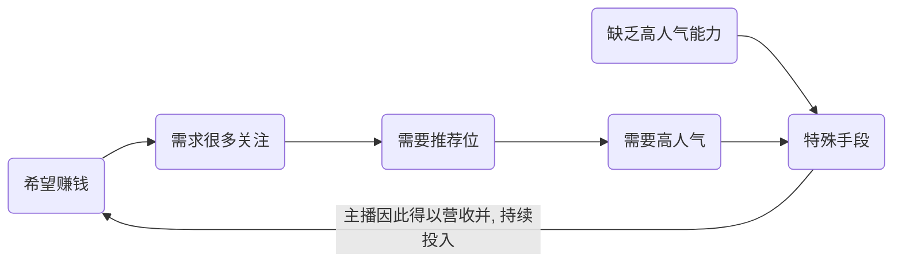
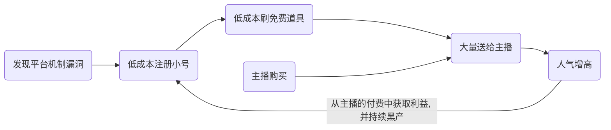
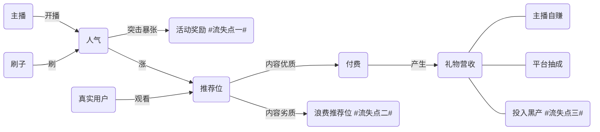

#一. 背景
- 我直播平台目前存在大量黑产, 表现为买关注刷人气等;
- 直播风控上线近一年, 技术上保护了抽奖等相关接口, 同时更对营收起到了保护作用;
- 本文阐述了风控在对抗黑产方面的工作进展, 计算对营收产生的影响, 并对未来加以预期以收获更好的成效.

_____
#二. 黑产流程
##二.(一) 概念描述

- 什么是黑产?
> 黑产是黑/灰色产业的简称. 其通过非正当手段谋取利益, 俗称薅羊毛. 在我们的直播平台中, 黑产通过批量注册小号, 利用脚本大量刷辣条, 使得主播提升曝光的方式获取利益, 让本身是免费的辣条道具, 成为了他们赚钱的工具, 耗用的却是我们的资源; 

> 黑产是风控的重点打击对象.

- 直观上看, 黑产影响了两个方面:
  - 技术方面浪费资源: 
  > 在送高能礼物时, 大量小号涌入直播间, 占用了大量系统和网络资源;

  - 用户体验和直播风气方面变差:  
  > 刷子在集中对于主播尤其是新人主播送道具刷人气的时候, 会集中登上七日榜等榜单, 也造成了不好的用户体验以及打破了主播间相对公平的竞争.

    
    

- 进一步看, 主播希望获取营收, 黑产希望薅羊毛赚钱. 所以黑产利用平台机制, 和有相关需求的主播私下交易形成了闭环链条. 
- 从主播角度来说:

- 从黑产刷子的角度来说:

- 综上, 黑产和购买黑产服务的主播之间, 实现了“合作共赢”. 在平台, 主播, 黑产三者之间, 抛开对于营收的影响, 至少我方投入的人力物力财力成本, 被消耗和利用.

##二.(二) 关系流程图:

_________

#三. 营收影响

##三.(〇)
更近一步看, 黑产极大程度的影响了营收, 该部分用数据支持, 推算黑产链上面的过程 
##三.(一) 小主播
通过跑数据, 处于被大批量小号刷辣条数量榜首的, 是一系列小主播, 关注数在1w以下, 但是再通过查看相关人气、营收金瓜子数据来看, 刷出的高人气难以快速转化为营收. 但是他们也占据了一定的曝光.

##三.(二) 大主播
过滤掉小主播, 发现在某一周(2019-01-23 ~ 2019-01-30)营收金瓜子排名前100的大主播中, 有93名主播存在小号疯狂刷量的现象, 在93名主播中, 其**黑产刷辣条**和最终转化为的**金瓜子**营收之间的关系大致如下

**其中虚线为趋势线, 证明二者之间有一定的正相关关系**

##三.(三) 用户体验
- 用户体验的好坏, 直接影响用户的付费意愿, 去留意愿. 直播环境良好, 弹幕友善本身是我直播平台的一大优势, 需要加以维护. 
- 黑产的存在, 会直接影响用户体验, 一方面大量刷子小号的存在, 会给真实用户不良体验; 另一方面, 忠实粉丝捧自家主播, 但效果却不如买流量的主播, 影响了用户粘度.

##三.(四) 小结
从全平台的主播行为分析来看, 可以关注主播几个阶段性的特征点
- 高质量 or 低质量
- 高关注 or 低关注 (粉丝量)
- 高人气 or 低人气
- 高营收 or 低营收

这里面的质量指的是主播本身及其直播内容的质量, 观众会比较关注的一些方面包括声音是否动听, 画面是否流畅, (游戏)技术是否高超, 

一般来说, 正常成长起来的大主播会按照路线
**高质量->高关注->高人气->推荐位->高营收**
良性循环下去

但是对于黑产和使用非法手段的主播来说, 我们不排除其中难免有才华出众者迫不得以采取该手段, 来快速把自己拉升到上述良性循环链条中, 而且相当数据显示诸多(超过90%)既成大主播, 多少存在着用刷子为自己提升人气的现象, 所以会诞生以下链路
**高质量->低人气->(刷子强刷)->高人气->推荐位->(用户认可)->高营收->高关注**

然而黑产会造就另外链路
**低质量->低人气->(刷子强刷)->高人气->推荐位->(用户不买帐)->低营收**

从影响营收的角度来看, 可能存在以下几种方式的影响
1. 从长期效应看, 刷子刷高主播人气, 主播上推荐位, 低质量主播挤掉高质量主播位置, 观众的付费意愿被削弱, 从而拉低了本应该存在的营收
2. 从短期效应看, 刷子刷高主播人气, 仅仅是为了挤进某排行榜, 获取相应的现金奖励, 相当于诈骗奖金
3. 从全局角度讲, 主播获利后的分成, 会流向三个部分, 一个是自身的收益, 一个是平常抽成, 还有一个是付费给了黑产, 极端的考虑这个问题, 付费给黑产的部分, 即便主播不要, 平台也可以抽走; 换个说法是, 黑车借用我们的平台和资源, 为自己生成了效益, 我方浪费了人力物力财力的情况下, 养活了黑产.

__________
#四. 风控现状
##四.(〇)
直播风控系统当前的主要工作, 是识别出黑产注册的小号, 拦截掉他们的抽奖行为, 可以总结为断其资源来路. 

##四.(一) 按接口
|title|number|else|
|:-----:|:-----:|:-----:|
|每日拦截量最高|1.节奏风暴; 2.小电视|小电视包括小电视类的各种|
|单日最高拦截量|20亿|节奏风暴, 18年12月到19年1月持续每日10亿以上|
|近半年日均拦截量|5.88亿|统计周期2018-07-02到2018-12-28|

结论
- 黑产刷子的目标明确, 就是获取亿元和辣条
- 节奏风暴的玩法造成了请求量和拦截量巨大
- 针对刷节奏风暴可以作出更合理的前置和后续处理, 例如
1. 提升领亿元门槛
2. 加入更合理的概率-提示体系
3. 跟踪亿元流向, 拦截道具的送出

##四.(二) 按规则
|title|number|else|
|:-----:|:-----:|:-----:|
|规则总数|8|8为当前有效的, 总共上过16条规则|
|每日拦截量最高|1.IP云主机; 2.referer异常; 3.有抽奖但无访问|前三名|
|单日最高拦截量|10亿|IP云主机规则|

结论
- ip仍然是绕不过的根本信息
- 用户行为逻辑异常会倒逼黑产开发者优化代码, 导致规则异常

##四.(三) 小结
1. 从业务接口角度说, 可以提升获取**免费道具**的门槛以及送出**加人气值道具**的难度;
2. 从规则角度说, 一方面IP情报可以继续挖掘内容, 另一方面行为逻辑的终点是判断刷子是否拉流
>拉流会使得黑产付出更多的带宽成本, 羊毛出在羊身上, 直播/用户使用的价格提升, 会大量削减黑灰产业链的发展, 当付出>回报的时候, 产业自然不存在, 或者出现新的形式

__________
#五. 一根辣条的前世今生
##五.(〇) 辣条对于整条链路的影响推算

综上, 黑产影响到的不仅仅是公平的竞争环境, 良好的社区氛围, 还通过一条较长的链路影响到了公司的营收, 涉及到了收益; 而风控在保护了接口稳定以及维持优质用户体验的同时, 也从一定程度上打击了黑产, 保护了营收的损失.

最后这里要给出一个推算: 辣条是黑产的切入口, 所以此时也会作为量化估计的基本单位, 衡量出我平台每被薅走一根辣条, 将会给黑产带来多少收益, 以及对我们带来多少营收上面的损失.

- 对于用户付费相关, 我们有以下结论可以作为参考: 

  1. 视频的内容上的特征带给用户的感官体验与用户积极的付费态度线性因果关系: 感知视频内容越具有丰富性、用户认为感知视频内容可信度越高、或者感知视频内容越是突显个性化, 越能正向促进用户积极的付费态度感知视频热度是指用户对感知内容的关注度, 表现在点击量、评论量上;
  2. 概括来说, 本段所探讨的感知网站特征包含的感知用户活跃度和感知收费价格两个子变量只有感知收费价格能显著负向影响用户的积极付费态度;
  3. 网站通过各种途径为自己做宣传的力度越大, 用户的口碑越髙, 越能吸引更多用户, 进而促进他们的付费态度;
  4. 在线支付、移动支付成为人们的日常, 网站采用的感知支付方式为用户所熟悉, 具有方便性、快捷性、低成本等特点, 用户支付上的困难小, 所以感知支付方式越方便快捷, 用户对付费行为的感知行为控制越强;
  5. 用户的付费态度越强, 他的付费意愿就越高;
  6. 用户对付费行为的感知行为控制越强, 更倾向于推进付费行为.

##五.(一) 基本假设
- 最终的目的, 是推算出黑产每刷到一根辣条, 能给黑产带来多少收益, 以及会让我们损失多少利益

- 为了推算方便, 将辣条视为一种“流通货币”

- 其他的相关的影响, 如直播内容质量, 用户付费意愿等, 量化为价值, 转化为$x$个单位辣条

- 一切影响因素, 相邻层级之间的正相关关系暂时均以线性关系表达

- 影响直播人气的因素, 只考虑(扩展因素列为"其他")
  1. 观众送道具数量
  2. CDN连接数
  3. 弹幕连接数
  4. 其他

- 影响主播质量的因素, 只考虑(扩展因素列为"其他")
  1. 业务能力(唱功 / 舞功 / 游戏技术)
  2. 个人魅力(颜值 / 声音 / 幽默 / 人品)
  3. 硬件配置(电脑配置 / 码率)
  4. 标题封面
  5. 其他
- 经过相关模型推算, 为了简化计算复杂度, 假设低质量主播营收金额只有高质量主播(本应该在推荐位的主播)的占比为$rate_{anchor}$ , 经过数据推算这个值在这里取$rate_{anchor} = 0.3$ 作为折损比例.

- 影响用户付费意愿的因素, 只考虑(扩展因素列为"其他")
  - 这个部分, 参考了相关研究成果. 对于付费意愿含义的解释, 一种应用较为广泛的解释是认为顾客愿意为特定商品或者服务质量改善而支付的额外价值, 也称为溢价付费意愿. 相关研究提出商家应该抓准人群特征而对不同的群体选取不同的经营策略. 根据计划行为理论研究模型, 有人员探索了影响某消费群体对食品安全付费意愿的因素. 研究表明, 顾客对安全食品的付费意愿是受“是否愿意支付额外费用”与“愿意支付多少额外费用”两者结合的影响.
  - 应用到我们的直播平台, 可以理解为, 观众
  1. 用户本身因素
    1-1. 是否愿意支付额外费用
    1-2. 愿意支付多少额外费用
  2. 直播客观因素
    2-1. 直播间人气
    2-2. 主播质量
  3. 其他因素

##五.(二) 符号说明

| 符号     | 解释          | 备注                     |
| -------- | ------------- | ------------------------ |
| $Lost_n(x)$ | 第n种营收损失 | 目前共三种                |
| $x$        | 辣条数量      | 亿元体量小, 暂也算作辣条 |
| $Mon$ | 钱 | RMB                         |
| $Pop$ | 人气值 |                          |
| $Rank$ | 人气排名 |                          |
| $K_{p-m}$      |人气-金钱比例               | 每元钱能张多少人气 |
| $K_{x-p}$        | 辣条-人气比例 | 涨1人气需要多少辣条 |
| $K_{p-r}$        | 辣条-排名比例 | 上升到一定名次需要的辣条量 |
|          |               |                          |

##五.(三) 公式推导

###五.(三).1 金钱和人气的关系
根据相关市场行情(某宝), 10元RMB大概可以购买5000-6000的人气值, 这里为了方便计算, 把相关数值取整数处理, 即10元RMB对应了5000人气值

$$
K_{p-m} = Pop / Mon = 5000 / 10 = 500 (人气值/元)
$$

###五.(三).2 人气和辣条的关系
根据上述分析可以得知, 人气会受到辣条数目, 在线人数, 弹幕连接数的综合影响, 如

$$
Pop(x) = K_{p-x} * x + K_2 * 在线人数 + K_3 * 弹幕连接数 
$$

考虑到实际情况, 辣条(银瓜子)礼物影响人气的倍率是固定不变的, 所以有

$$
K_{x-p} = {1 \over 1000} 
$$

与此同时, 通过观察, 黑产在给主播刷辣条的时候, 批量小号数目大体固定, 考虑到$K_3$实际上远小于$K_2$, 并且人数稳定在80-200之间, 故选取固定值150作为参数

所以得到

$$
Pop(x) = {1 \over 1000} * x + 150 
$$

###五.(三).3 营收的损失推算
1. 浪费推荐位 -- $Lost_1(x)​$ 
  - a. 定性分析
      人气受到辣条的影响, 上述已经讨论清楚
      主播排名会收到实时人气值的影响, 根据最近几天的人气值-排名次序关系可以得到之间的转换系数
      主播之间的质量之差, 可以通过辣条的数量体现出来
      而单位质量转化为金钱, 也受到一个系数的分配

  - b. 定量分析

      人气值-排名次序关系可以得到之间的转换系数$K_{p-r}$, 其中这个关系只关心排名较高的几名, 所以在小区间内可以近似看作线性关系, 有(数据见附件)

      $$
      K_{p-r} = {1 \over 13551};
      b_{p-r} = -25.88
      $$

      所以可以得到: 

      $$
      Rank(Pop) = K_{p-r} * Pop + b_{p-r} = {1 \over 13551} * Pop - 25.88
      $$

      并且可知, 被刷上去的推荐位的排名越靠前, 对于全局的影响越大, 所以被刷主播占据排位和对应折损率之间的关系可以拟合为

      $$
      Rate(Rank) = -0.01 * (10-Rank) + rate_{anchor}
      $$

      带入之前的式子, 得到和辣条之间的关系

      $$
      Rate(x) = 0.46 + {1 \over 1.3E+09} * x
      $$

      而排名数字和营收数额之间的关系, 可以用下式来描述

      $$
      Money(Rank) = 342.98 * Rank + 12397
      $$

      以上可以得到, 营收损失即为主播的质量差导致的金钱差值, 即为

      $$
      Lost_1(x) = 2.04*10^{-13} * x^2 + 3.93*10^{-5} * x + 1622
      $$

2. 活动奖励 -- $Lost_2(x)$ 
  - a. 定性分析
       活动奖励的最终金额, 将会受到活动影响力等等方面的影响, 为了简化模型, 此处的系数暂时表达为1, 即为一个没有倍率的常系数
       而奖励金额和辣条之间的关系, 则可以直接又线性关系表达
  - b. 定量分析
       上述的表达式, 又相关活动的数据综合给出为:
       
       $$
       Lost_2(x) = 0.0685 * x + 666.2
       $$
  
3. 投入黑产 -- $Lost_3(x)​$ 
  - a. 定性分析
       这一项的影响, 其相关系数上述均为讨论过, 分别为
       k1 : 每个辣条可以刷多少人气
       k2 : 每个人气值需要多少钱
       两个系数联系起来了辣条和投入黑产的金额之间的关系
  - b. 定量分析
  - 
       $$
       Lost_3(x) = {1 \over 500000} * x + 0.3
       $$

综述, 

$$
Lost(x) = \sum_{i=1}^3{k_i*Lost_i(x)}
$$

其中三个损失营收函数前面$k_i$为比例系数, 且应该满足

$$
\sum_{i=1}^3{k_i} = 1
$$
在条件均等条件下, 或者条件未知的情况下, 即在没有明确主播有意刷哪种营收更多的情况下, 考虑一根辣条的流向最终将会消亡, 所以取
$$
k_1 = k_2 = k_3 = {1 \over 3}
$$
有
$$
Lost(x) = 6.8*10^{-14}*x^2 + 0.0228 * x + 762.8
$$

##五.(四) 计算影响

###五.(四).1 单直播计算
对于直播间 roomid = 60895 刷辣条量存在异常

|日期|辣条量|影响的营收数额|
|----|----|----|
|20190124|7213|927.2917786|
|20190125|5571|889.8399045|
|20190126|5347|884.7310415|
|20190127|5356|884.936307|
|20190128|5552|889.4065608|
|20190129|3912|852.0040065|
|20190130|3579|844.4099103|
|20190131|3492594|88688.72794|

###五.(四).2 风控拦截总量计算

风控每天拦截的小电视抽奖, 刚好拦住了刷子们生产辣条, 辣条有效期30天, 刷子们为了避免被封, 平滑送礼, 所以当天的拦截量平分成30份, 则可以当作是送辣条量

|日期|拦截领取辣条|辣条分30天送完|挽救营收数额|
|----|----|----|----|
|20190211|359371869|11979062.3|563368.1836|
|20190212|334558403|11151946.77|339596.0096|
|20190213|306429762|10214325.4|304595.4806|
|20190214|299727953|9990931.767|296432.7722|
|20190215|237853001|7928433.367|224275.9186|
|20190216|275453654|9181788.467|267435.1399|
|20190217|207347235|6911574.5|190830.2048|

_______________
#六. 补充与展望
##六.(一) 不足
1. 从完整性方面讲, 风控系统一方面要对黑产进行截源, 一方面也要截流; **送道具接口**也需要接入风控;
2. 从实时性方面讲, 目前系统离线计算24h前的数据, 黑产可以利用不断注册小号, 轮休账号等方式绕开, 所以需要考虑加入**实时计算**;
3. 从准确性方面来讲, 目前策略还是更多的依靠了人工分析, 以及最基础的特征工程, 在面对多种多种不同的脚本/外挂/策略的时候, 往往不能覆盖全面, 甚至是在黑产修改了自身的方案之后, 我方也得为之作出相应调整, 诸多有待完善;
4. 以上三个方面是从技术角度出发, 而从影响到的营收角来讲, 解决了技术问题, 也将会进一步的保护上面推算得到的营收状况.

##六.(二) 方案及评估

###六.(二).1 方案描述
1. 对于解决**完整性**的问题, 首先要保证的是风控自身足够准确; 另外存在一个困难, 对于小电视抽奖/节奏风暴等服务, 接入风控系统是可以有效的保护其接口, 从效果上看是减少了对于抽奖服务的访问次数, 同时也保护了营收等方面; 但是如果要是让**送道具接口**接入风控系统, 从·全局的角度看, 是可以做到保护用户体验, 保护营收, 打击黑产, 但是从接口调用方的服务角度来看, 则是凭空增加了服务的压力. 所以这个方面的工作, 更多的是要考虑怎么和送道具的相关服务的对接, 充分考虑其能容忍的超时时间, 以及误判造成的影响等; 退而求其次, 既然是送辣条影响到了人气, 如果送的接口不方便对接, 那么可以考虑在**计算实时人气阶段**对黑产用户的辣条加以过滤剔除等等. 上述策略的实施需要进一步的调研.
2. 对于解决**实时性**的问题, 计划使用**Flink/Spark streaming**等技术手段, 处理当前访问和抽奖行为的日志, 对用户进行计算和打分等逻辑; 一方面, 虽然叫做实时计算, 但是仍旧是要去统计和计算一段时间内的行为数据, 简单来看是把原本24h的延迟, 缩短到5-10min左右, 所以可以考虑利用原有风控的规则, 开发移植成为实时版本; 另一方面, 长期的行为和短期的行为不见得能够体现出一致的统计特征, 所以还需要根据具体实践, 开发出相应的处理规则, 计划H1可以上线第一版本的, 处理单个日志/规则, 并且同时做好系统的扩展方案, 方便日后多日志多规则的融合升级.
3. 对于解决**准确性**的问题, 考虑加入更多的机器学习算法, 训练出抽象的**模型**.因为目前主要是靠人工发现和制定规则, 甚至规则的阈值都是经验所得, 这样做的缺点一个是慢, 一个不准, 利用训练的模型, 可以弥补尚未发现的规律, 合理的制定阈值等; 另外, 由于风控本身是一个对抗的过程, 不会存在一种一劳永逸的策略和算法, 这样做既可以解决每次黑产有了更为肉眼难以识别的策略之后, 我们自身响应和发现异常的周期过于漫长的问题. 参考业界做的相对成熟的体系, 结合自身的特点, 优化升级风控系统.
4. 验证码. 参考其他平台, 验证码也是风控系统中的一个重要工具, 目前验证码流程已经打通, 需要做的事情是制定好技术-产品-用户都能够接受的验证码弹出策略. 利用验证码不仅可以达到更好的拦截效果, 更可以参考拦截的结果日志等, 计算出更准确的数据.
5. 风控画像. 有些平台的风控, 是在一个大的项目下, 包含了用户画像,推荐,风控等多个业务;有些平台的则是用户画像,风控画像,订单画像等每个业务都做出了画像. 这个方面可以结合我们正在做的直播用户画像, 做合理的画像工作. 

###六.(二) 效果预估
1. 技术方面, 对标更成熟的系统, 参考如下公司公开方案, 制定理性化的评价风控系统的指标

    <h4>京东:</h4>

    <h4>携程:</h4>

2. 最后, 营收方面, 只有做好上述多个维度的工作, 目标是达到如下的效果预期, 真正的目的是对于保护营收和增长营收作出贡献:

|日期|黑产辣条|预估未来风控控制量(RMB)|现行风控控制量(RMB)|较现有系统的增长率|
|:----:|:----:|:----:|:----:|:----:|
|20190211|49718798|371464.0153|1134519.488|150%|
|20190212|35473587|339596.0096|809646.1531|142%|
|20190213|29468916|304595.4806|672713.1372|145%|
|20190214|18785698|296432.7722|429100.7118|169%|
|20190215|17688351|224275.9186|404078.4785|156%|
|20190216|33825983|267435.1399|772073.0178|135%|
|20190217|24673859|190830.2048|563368.1836|134%|

